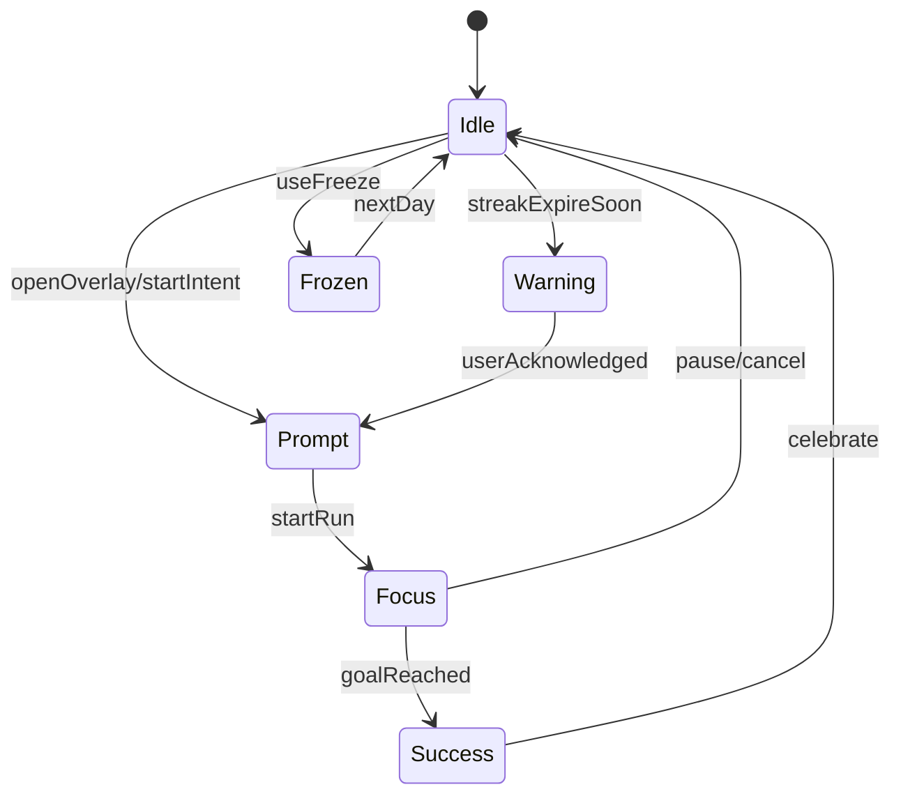

# Bychok — обзор проекта

Bychok — браузерное расширение с дружелюбным маскотом-бычёнком, которое помогает учиться и работать в формате коротких сфокусированных сессий. Оно объединяет игровые механики (стрики, награды, квесты) с уважительным отношением к пользователю и строгим подходом к приватности.

## 1. Продуктовое видение

* **Микрофокус.** Пользователь выбирает сайты, где хочет прогрессировать, и запускает короткие «заезды» (3–15 минут). Каждая успешная сессия повышает прогресс и поддерживает серию.
* **Низкое трение.** Виджет появляется поверх выбранного сайта в правом нижнем углу и не требует переключения на отдельные приложения.
* **Геймификация без токсичности.** Серии (стрики), бейджи, мягкие напоминания и косметические награды формируют позитивную мотивацию без шейминга.
* **Privacy-first.** Все данные о пользователе и активности хранятся локально. Любые интеграции (например, Telegram-бот) активируются только по явному согласию.

## 2. Бренд и тональность

* **Имя:** рабочие варианты — Bychok, Toro-Go, Buchi. Основная айдентика строится вокруг имени «Bychok».
* **Маскот:** милый бычёнок с мягкими рогами, крупными глазами и «энерги-хвостиком». Цветовая палитра тела — карамель и пастель, контуры тёплые и мягкие.
* **Тон коммуникации:** игривый, поддерживающий, слегка дерзкий. Примеры фраз: «Погнали на 5 минут? 🛹», «Жарко! Серия +1 🔥».

## 3. Визуальная система

### 3.1 Палитра

| Токен | Значение | Цвет |
| --- | --- | --- |
| `--brand-primary` | Indigo Vibe | `#6A5AF9` |
| `--brand-secondary` | Neon Mint | `#2EF4D1` |
| `--brand-accent` | Electric Raspberry | `#FF2E63` |
| `--brand-warm` | Daylight Yellow | `#FFD166` |
| `--neutral-900` | Midnight Ink | `#0F1020` |
| `--neutral-800` |  | `#16172A` |
| `--neutral-700` |  | `#1E2036` |
| `--neutral-600` |  | `#2A2C47` |
| `--neutral-400` |  | `#6E7391` |
| `--neutral-200` |  | `#C9CBE0` |
| `--neutral-100` |  | `#E8EAF7` |
| `--neutral-50` |  | `#F6F7FF` |
| `--success` | Feedback | `#20C997` |
| `--warning` | Feedback | `#FFB020` |
| `--danger` | Feedback | `#EF476F` |
| `--info` | Feedback | `#4EA8DE` |

Градиенты: `Energy` (Indigo Vibe → Neon Mint), `Sunset` (Electric Raspberry → Daylight Yellow). Тени и стеклянные эффекты задаются через Shadow S/M/Glow и стеклофон (`backdrop-filter: blur(10px); background: rgba(15,16,32, .5)`). Скругления: от 8px до 32px, для бейджей/попапов — 28px.

### 3.2 Типографика

* Заголовки и UI: `Inter`, `SF Pro`, `Segoe UI`, fallback `system-ui`, вес 600.
* Текстовые блоки: вес 400, размеры 14–18 px, межстрочный интервал 1.25–1.4.
* Кнопки: вес 500.
* Счётчик времени: `JetBrains Mono` (`ui-monospace`).
* Размеры шрифтов: Display (28/32/40), Title (20/24), Body (14/16/18), Caption (12).

## 4. Маскот и анимации

Основные эмоции и сценарии взаимодействия описаны через набор Lottie-анимаций (до 150–200 KB каждая) с SVG fallback:

1. `idle-chill` — лёгкое покачивание и моргание.
2. `hello` — приветствие при открытии интерфейса.
3. `focus-on` — надевание наушников и запуск таймера.
4. `nudge-soft` — мягкое приглашение на 5-минутный заезд.
5. `warning-expire` — напоминание о скором сгорании стрика.
6. `success` — прыжок с конфетти.
7. `streak-saved` — заморозка серии.
8. `sleep` — режим тихих часов.
9. `oops` — дружелюбное признание ошибки.
10. `quest` — предложение «Квеста дня».

## 5. Основные компоненты UI

### 5.1 Оверлей-виджет (content script)

* **Позиция:** правый нижний угол, отступы 24 px.
* **Состояния:** свёрнутый (72×72 px — кнопка с маскотом) и развёрнутый (320×420 px — стеклянная карточка).
* **Содержимое:**
  * кольцо прогресса и счётчик времени (моно-шрифт);
  * кнопки `Start 5-min run`, `Pause`, `Add 5 min`;
  * индикатор стрика с огоньком и счётчиком дней;
  * мини-квест (например, «Пройди 2 страницы»);
  * селектор текущего сайта/фильтра;
  * кнопка «Скрыть на этом сайте на 24ч».
* **Темизация:** полу-прозрачный фон, адаптация к цветам страницы, соблюдение контраста.

### 5.2 Pop-out (Document Picture-in-Picture)

* Размер 240×160 px, скруглённые углы.
* Внутри: маскот, мини-кольцо прогресса, кнопка паузы, mute.
* Открывается по желанию из попапа/оверлея, автоматически сворачивается при полноэкранном видео.

### 5.3 Системные уведомления

* Шаблоны: предупреждение о серии («Гори-не гори»), успех («Стрик спасён!»), старт квеста.
* Используют иконку маскота (128×128), короткий текст, кнопки действия (`Start 5-min`, `Snooze`).

### 5.4 Side Panel (опционально)

* Отображает список сайтов, графики прогресса, квесты, магазин косметики.

### 5.5 Popup расширения

Вкладки: Home, Sites, Quests, Shop, Settings. Основные элементы:

* Home — быстрый старт, текущий прогресс.
* Sites — управление доменами/порогами, тихие часы, включение оверлея.
* Quests — до трёх ежедневных заданий.
* Shop — косметика маскота (очки, фоны, аксессуары).
* Settings — приватность, уведомления, streak-freeze, PiP-режим.

## 6. Механики и функциональность

* **Стрики:** учитываются по домену (опционально по пути). Базовый порог — 5 минут в день, настраивается 1–30 минут.
* **Streak Freeze:** один бесплатный «заморозить день» в неделю; Pro-версия — до трёх.
* **Квесты:** задачки вроде «2×5-мин заезда», «На 2 разных сайтах», «Закладка-день».
* **Награды:** бейджи (Bronze/Silver/Gold), косметика, уникальные фоны.
* **Экономика:** Horn Coins выдаются за milestones, тратятся на визуальные улучшения.
* **Анти-стресс:** мягкие уведомления, паузы, отсутствие негативных экранов.

### 6.1 Трекинг активности

* Активная минута засчитывается, если вкладка в фокусе, `document.visibilityState === 'visible'`, зафиксирована пользовательская активность (`keydown`, `mousemove`, `scroll`) в последние 30 секунд или получен heartbeat из контент-скрипта.
* Время разбивается на слоты по 10–15 секунд и агрегируется в сервис-воркере.
* Эвристики защиты от читинга: игнорируем длительное залипание курсора и синтетические события.

### 6.2 Хранение данных

* `chrome.storage` — локальное хранилище с сущностями `Site`, `Session`, `Streak`, `Settings`, `Cosmetics`.
* Поддержка экспорта/импорта JSON.
* Смена часового пояса учитывает пересчёт суток и сохранение серий.

### 6.3 Уведомления и тихие часы

* Пользователь настраивает тихие часы; в этот период пуши не отправляются (или заменяются мягкими нуджами внутри приложения).
* Предупреждаем о сгорании стрика (за 3 часа), предлагаем быстрый старт или Snooze.

## 7. Разрешения и архитектура MV3

* Разрешения: `storage`, `scripting`, `tabs`, `alarms`, `notifications`, опционально `sidePanel`.
* Хост-права запрашиваются только для доменов, добавленных пользователем.
* Основные компоненты: service worker (агрегация времени, уведомления), content script (оверлей, отслеживание активности), popup (управление), опциональный side panel и PiP-документ.

## 8. Модель данных

```json
{
  "Site": {"id": "uuid", "pattern": "leetcode.com", "pathPrefix": "/problems", "dailyGoalMin": 5, "overlayEnabled": true},
  "Session": {"id": "uuid", "siteId": "uuid", "date": "YYYY-MM-DD", "activeMinutes": 7},
  "Streak": {"siteId": "uuid", "length": 12, "lastDate": "YYYY-MM-DD", "frozenDaysLeft": 1},
  "Settings": {"tz": "+02:00", "quietHours": [[22,7]], "pipEnabled": false, "notifications": true},
  "Cosmetics": {"owned": ["glasses-01", "cap-02"], "active": {"hat": "cap-02"}}
}
```

## 9. Состояния пользователя

Диаграмма состояний (Mermaid):



## 10. Копирайтинг и локализация

* Старт: «Погнали на 5 минут? 🛹»
* Во время сессии: «Ещё 2:30 — держу темп!»
* Почти финиш: «Финишная прямая — 0:30 🚀»
* Успех: «Жарко! Серия +1 🔥»
* Предупреждение: «Серия на волоске — спасём за 5 минут?»
* Фриз: «День на паузу. Серия цела ❄️»

## 11. Онбординг

1. Приветствие с анимацией `hello` и краткое объяснение концепции.
2. Выбор двух сайтов из предложенного списка или добавление своего.
3. Настройка базового порога (5 минут) и запуск первого заезда.
4. Демонстрация оверлея, таймера и награждение бейджем «День 1».

## 12. Метрики (локально)

* First Run — первый день достижения цели по сайту.
* Day Active — минут активной работы по сайту.
* Streak Length per Site — длина серий.
* Quest Completion — завершённые квесты.
* Overlay Hide Rate — доля скрытий виджета.

## 13. Магазин косметики (опционально)

* Слоты: шапка, очки, фон, «энерги-хвостик».
* Редкости: Common, Rare, Epic.
* Покупки за Horn Coins или через Pro-перки. Исключительно визуальные изменения, без влияния на прогресс.

## 14. Дорожная карта

* **v0:** сайты, пороги, стрики, оверлей, локальные уведомления.
* **v0.1:** квесты, streak freeze, тихие часы.
* **v0.2:** фильтры по пути, side panel, магазин косметики, Telegram-дайджест.
* **v0.3:** Pop-out PiP, расширенные темы и кастомизация маскота.

## 15. QA-чеклист

1. Оверлей не перекрывает критичные элементы сайта, легко перетаскивается и закрывается.
2. Контраст текста соответствует WCAG AA на светлых и тёмных фонах.
3. Уведомления уважают тихие часы и не повторяются чрезмерно.
4. Смена часового пояса корректно влияет на расчёт серий и дней.
5. При открытии нескольких вкладок одного сайта не происходит двойного подсчёта.

## 16. Пакет ассетов для релиза v0

* Lottie: `idle-chill.json`, `hello.json`, `focus-on.json`, `nudge-soft.json`, `warning-expire.json`, `success.json`, `streak-saved.json`, `sleep.json`, `oops.json`, `quest.json`.
* Иконки: 16/32/48/128 px, PNG/WebP с маскотом.
* Набор CSS-переменных с палитрой и токенами.
* JSON со схемой данных (см. выше).

## 17. Дополнительные требования к этике и приватности

* По умолчанию все данные локальны; удалённые интеграции включаются вручную.
* Ограничиваем количество уведомлений в день и даём пользователю лёгкую опцию «тихого режима».
* Предоставляем возможность заморозить серию без давления и негативных последствий.

Документ используется как центральный источник знаний о продукте и обновляется при расширении функциональности.
